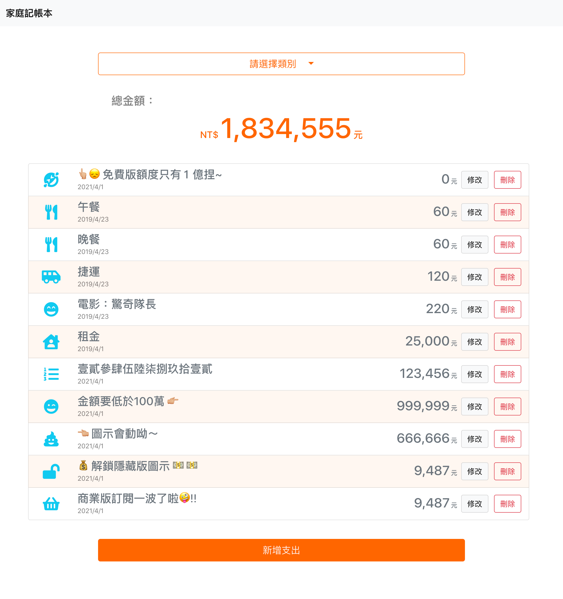
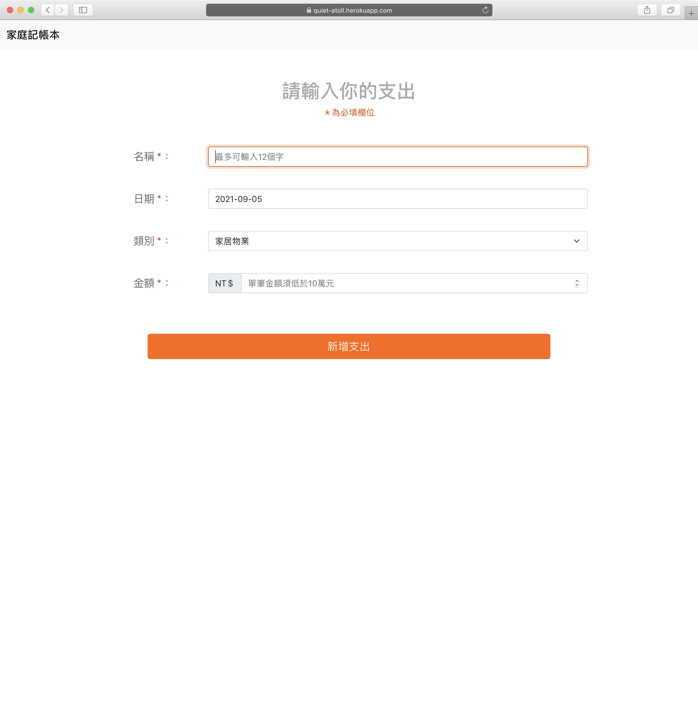
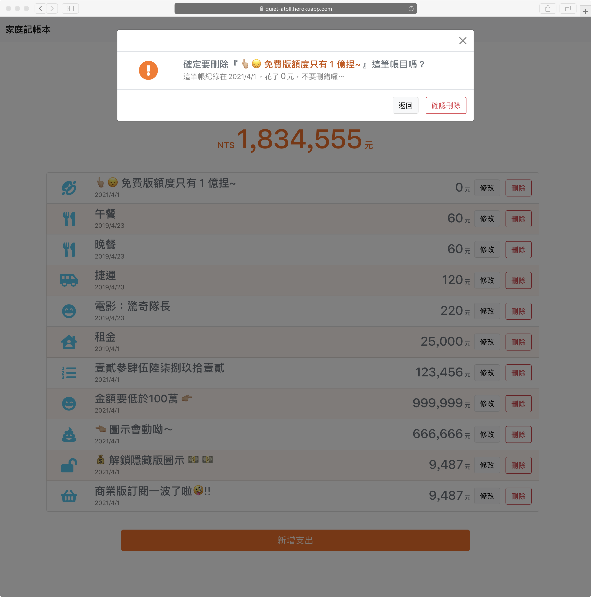
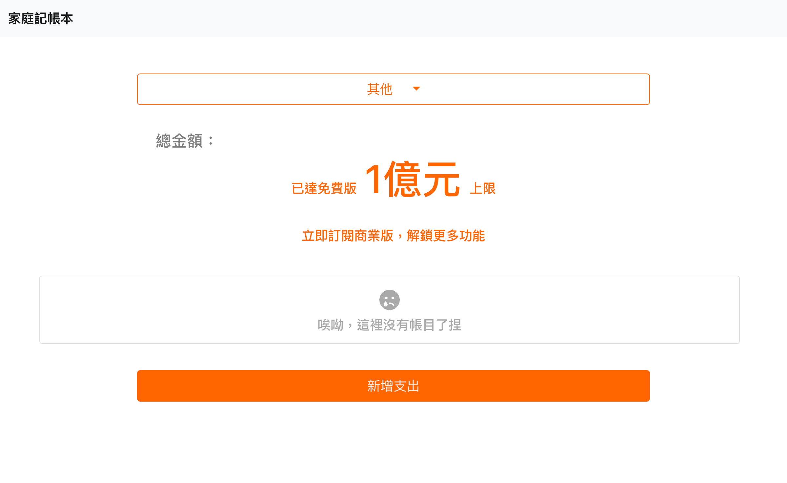

# 老爸的私房錢
致力於提供使用者直覺、友善的記帳體驗<br>打造數位移民也能輕易理解並且上手的線上記帳服務
- [X] 記帳功能
  - [X] 可紀錄每筆支出的名稱、日期、類別、金額
  - 目前提供4種支出類別：家居物業、交通出行、休閒娛樂、餐飲食品
- [X] 帳務管理
  - [X] 在首頁檢視所有支出紀錄
  - [X] 對個各支出進行修改、刪除的功能。
- [X] 分類功能
  - [X] 在首頁切換各類別支出
  - [X] 自動計算所選類別支出總額
<br><br>

- 提升使用者體驗設計
  - [X] 新增支出及修改支出頁面，自動聚焦對應輸入項目
  - [X] 新增支出頁面，時間欄位會自動帶入當天日期
  - [X] 點擊刪除會出現確認視窗，及動畫提示
  - [X] 所選類別沒有支出項目時時會顯示提示

- 額外功能
  - [X] 😈😈總金額１億元上限<br>總金額到達１億元後，選擇任何類別總金額皆提示使用者到達上限😏😎

<br>




<br><br>

## 1.安裝專案資料
1. 將原始碼安裝至指定位置，你可以採取下列其中一種方法
    1. 點選右上方綠色『Code』按鈕，選擇『Download ZIP』下載ZIP檔，並解壓縮至專案資料夾中。
    2. 開啟『終端機 Terminal.app』，或在Ｗindows 開啟『命令提示字元 cmd』
 
    輸入指令，移動到該專案資料夾位置
    ```
    cd 「專案資料夾路徑」 (資料夾名稱間的空格要用「 / 」隔開)
    ```
    輸入指令將專案clone至專案資料夾
    ```
    git clone https://github.com/Pudding1989/Expense-Tracker.git
    ```

2. 安裝伺服器至指定位置
   1. 下載 [MongoDB Community Server](https://www.mongodb.com/try/download/community) （專案使用 for MacOS的 4.2.15 版本），並解壓縮至指定位置，重新命名為「mongodb」
   2. 建立資料庫資料夾，命名為「mongodb-data」
   3. 「mongodb」(資料庫伺服器資料夾)及「mongodb-data」(資料庫資料夾)，可以與專案原始碼資料夾不同位置
 
<br>

## 2.啟動資料庫
### 開啟『終端機 Terminal.app』，或在Ｗindows開啟『命令提示字元 cmd』執行以下指令
<br>

1. 移動至伺服器資料夾「mongodb」的下一層執行檔資料夾「bin」

    ```
    cd 「mongodb(MongoDB Community Server) 資料夾路徑」\bin
    ```

2. 執行下列指令，啟動資料庫伺服器

- 瀏覽網站時，要保持資料庫伺服器運作，否則網站將無法讀取資料

   ```
   ./mongod --dbpath 「mongodb-data」(資料庫資料夾)完整路徑
   ```  
<br>

## 3.啟動專案
### 另外開啟一個終端機視窗(或是命令提示字元)，並保持資料庫伺服器持續執行中
<br>

1. 移動到專案資料夾  

```
cd 「專案資料夾路徑」 (資料夾名稱間的空格要用「 \ 」隔開)
```
2. 建立種子資料
```
npm run seed
```
   - 指令執行完畢後，終端機會恢復可輸入狀態。如果程式沒有自動結束，終端機顯示 `「播種完畢 <(￣︶￣)>」`訊息後，即可按下 ` ⌃ (Ctrl) + c` 退出程式
3. 安裝本專案使用的套件
```
npm install
```
4. 輸入執行指令，開啟本地端應用程式伺服器及資料庫伺服器
```
npm run dev
```
- 當終端機顯示訊息 `NOW, Express is start listening on http://localhost:3000` ，表示已成功開啟應用程式伺服器
- 當終端機顯示訊息 `MongoDB Connected  ｡:.ﾟヽ(*´∀`)ﾉﾟ.:｡  ，表示已成功連線至資料庫伺服器

5. 於瀏覽器開啟網站
```
http://localhost:3000/
```

6. 記得在終端機按下 ` ⌃ (Ctrl) + c` 或是在命令提示字元 `ctrl + c` ，關閉本應用程式伺服器及資料庫伺服器

## 開發工具版本

後端框架
- Node.js: 10.15.0
  <br><br>
  語意化路由套件
  - Method-override: 3.0.0

後端套件
- Node Express: 4.17.1

資料庫
- Mongoose: 5.13.7

模板引擎
- Express Handlebars: 5.3.3

前端框架
- Bootstrap: 5.1.0

  Bootstrap JavaScript plugin
    - Popper: 2.9.3 min UMD build

圖示套件
- Font Awesome: 5.15.4

Coding Style 檢查套件
- JavaScript Standard Style: 16.0.3